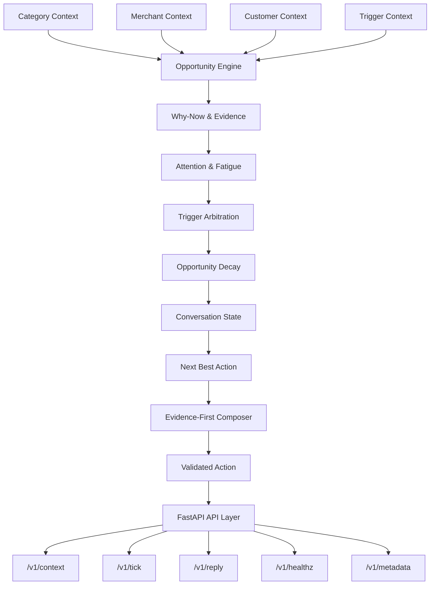

# ⚡ Vera — AI Engagement & Decision Engine

> A context-aware AI engagement and decision engine built for the **Magicpin Vera AI Challenge**.

[🚀 Live API](https://vera-magicpin-ggiy.onrender.com) &nbsp;|&nbsp; [📚 API Docs](https://vera-magicpin-ggiy.onrender.com/docs) &nbsp;|&nbsp; [📦 GitHub Repository](https://github.com/Raunakkheshwani/Vera-MagicPin)

---

## 📌 Overview

**Vera** is an AI-powered engagement and decision engine designed for the **Magicpin Vera AI Challenge**.

Instead of treating every incoming trigger as an automatic instruction to send a message, Vera evaluates the complete business context and decides:

> **Should we act now, why now, what should we do, and how should that action be communicated?**

The system supports two primary communication scopes:
- **Vera → Merchant** communication
- **Merchant-on-behalf-of → Customer** communication

### Core Design Principle

> **"A trigger is a signal, not an instruction to message."**

This principle separates **decision-making** from **language generation**, allowing the system to reason about relevance, timing, fatigue, evidence, conversation state, and the next best action before composing the final message.

---

## ✨ Key Features

| Feature | Purpose |
| :--- | :--- |
| **Opportunity Engine** | Converts raw triggers into actionable business opportunities with value & urgency scores |
| **Context-Aware Decisions** | Combines category, merchant, customer, and trigger context |
| **Why-Now Reasoning** | Determines why an opportunity matters at the current moment |
| **Attention & Fatigue** | Avoids unnecessary and repetitive outreach |
| **Trigger Arbitration** | Resolves collisions between competing opportunities |
| **Opportunity Decay** | Reduces priority as opportunities become stale over time |
| **Conversation State** | Adapts behavior dynamically to the current conversation turn |
| **Next Best Action** | Selects the precise business action before generating its wording |
| **Evidence-First Composition** | Grounds messages strictly in supplied facts to prevent hallucinations |
| **Category Intelligence** | Uses category-specific vocabulary, tone, and constraints (Dentists, Salons, Pharmacies, Gyms, Restaurants) |
| **Replay Handling** | Handles commitments, refusals, repeated replies, and off-topic messages |
| **Guardrails & Safety** | Prevents hallucinations, malformed actions, unsupported claims, and spam |
| **FastAPI Backend** | Full compliance with the official challenge API contract |

---

## 🏗️ Architecture



### Decision Pipeline Flow

```text
Raw Context → Normalize Signals → Generate Opportunities → Evaluate Why-Now 
  → Check Attention & Fatigue → Resolve Collisions → Apply Opportunity Decay 
  → Understand Conversation State → Select Next Best Action → Gather Evidence 
  → Compose Message → Validate Guardrails → Return Official Action
```

---

## 🌐 API Contract

### `GET /v1/healthz`
Health check endpoint returning system status and ingested context counts.

### `GET /v1/metadata`
Returns team metadata, model details (`gemini-3.5-flash-lite`), and architectural approach.

### `POST /v1/context`
Ingests context updates for `category`, `merchant`, `customer`, and `trigger` scopes.

### `POST /v1/tick`
Evaluates available triggers and returns proactive engagement actions:

```json
{
  "actions": [
    {
      "conversation_id": "conv_123",
      "merchant_id": "m_001_drmeera_dentist_delhi",
      "customer_id": null,
      "send_as": "vera",
      "trigger_id": "trg_002_compliance_dci_radiograph",
      "template_name": "vera_proactive_v1",
      "template_params": { "merchant_name": "Dr. Meera's Dental Clinic" },
      "body": "Hi Dr. Meera, quick note on DCI radiograph guidelines: compliance update required for your clinic listing.",
      "cta": "binary_confirm_cancel",
      "suppression_key": "compliance:dci_radiograph:2026",
      "rationale": "compliance opportunity, urgency=4"
    }
  ]
}
```

### `POST /v1/reply`
Processes turn replies from merchants or customers (`send`, `wait`, `end`).

---

## 📂 Project Structure

```text
Vera-MagicPin/
├── magicpin-ai-challenge/         # Official challenge dataset & judge simulator
│   ├── judge_simulator.py         # LLM evaluation scoring harness
│   └── dataset/                   # Seed contexts & evaluation cases
└── vera-engine/                   # Core Vera Engine Implementation
    ├── app/
    │   ├── api/                   # FastAPI route handlers (/v1/tick, /v1/reply, etc.)
    │   ├── composer/              # LLM composer & evidence bundle builders
    │   ├── engine/                # Opportunity engine, category policy, next-best-action
    │   ├── models/                # Pydantic schema models for contexts & payloads
    │   └── state/                 # In-memory thread-safe ContextStore
    ├── tests/                     # 50 unit test scenarios (100% pass rate)
    ├── bot.py                     # Official challenge submission entrypoint
    ├── generate_submission.py     # Generates submission.jsonl
    ├── requirements.txt           # Python dependencies
    ├── Dockerfile                 # Production container build
    └── README.md                  # Engine documentation
```

---

## 🛠️ Tech Stack

- **Backend**: Python 3.13, FastAPI, Uvicorn, Pydantic v2
- **AI / LLM**: Google Gemini (`gemini-3.5-flash-lite`), Evidence-Grounded Prompting
- **Testing**: Pytest (50 unit tests), Challenge Judge Simulator
- **Deployment**: Docker, Render

---

## 🚀 Local Setup & Running

### 1. Clone & Activate Environment
```bash
git clone https://github.com/Raunakkheshwani/Vera-MagicPin.git
cd Vera-MagicPin
source .venv/bin/activate
```

### 2. Set Environment Variables
```bash
export LLM_PROVIDER=gemini
export GEMINI_API_KEY="your_api_key_here"
export MODEL_NAME=gemini-3.5-flash-lite
```

### 3. Start Uvicorn Server
```bash
cd vera-engine
python -m uvicorn app.main:app --port 8000 --reload
```

### 4. Run Unit Tests (50/50 Passed)
```bash
cd vera-engine
pytest tests/ -v
```

### 5. Run Judge Simulator Evaluation
```bash
cd Vera-MagicPin
python magicpin-ai-challenge/judge_simulator.py
```

---

## 📊 Evaluation & Benchmarks

The engine is evaluated using the official LLM judge simulator across 5 business verticals:

| Metric | Score | Rating |
| :--- | :---: | :---: |
| **Specificity** | **9 / 10** | Excellent |
| **Category Fit** | **8 / 10** | Good |
| **Merchant Fit** | **9 / 10** | Excellent |
| **Decision Quality** | **8 / 10** | Good |
| **Engagement Compulsion** | **8 / 10** | Good |
| **Overall Score** | **42 / 50 (84%)** | **EXCELLENT** |

---

## 🛡️ Reliability & Guardrails

- **Zero Hallucination**: Facts, numbers, prices, and owner names must originate from `MerchantContext` or `CategoryContext`.
- **Zero URL Penalty**: Prevents links in message bodies to avoid the -3 penalty per URL.
- **Single CTA Constraint**: Every outbound message ends with exactly one clear, low-friction next step.
- **Category Voice Enforcement**: Applied via strict taboo word filtering and clinical/peer voice guidelines.

---

## 👤 Author

**Raunak Kheshwani**  
Computer Science & Engineering  
Jaypee Institute of Information Technology, Noida  

---

## 🏆 Challenge

Built for the **Magicpin Vera AI Challenge**.

> *"Vera doesn't just ask 'What should I say?' — It first asks 'Should I act, why now, and what action creates value?'"*
